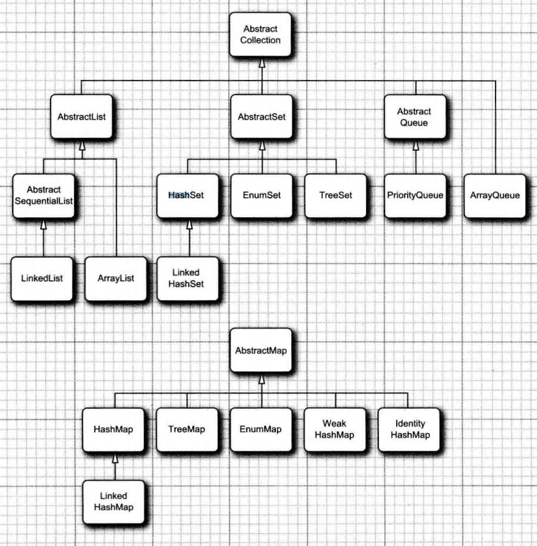

# 目标
1、 怎样使用  
2、 知道各个类内部使用的何种数据结构，这样才能在实际场景中知道如何选择。比如，ArrayList 和 LinkedList都能够实现功能，什么场景下用哪一种?    

# 关系
Collection分为List 、 Set、Queue。跟Collection平行的有Map。参考图：  

#  几大接口： List 、 Set 、Queue 、Map
>* List 接口用于描述一个 *有序集合* ，元素 *可重复* ,并且集合中每个元素的位置十分重要。  
>* Queue： 队列。 Deque:双端队列,继承自Queue  
>* Set 确保数据*不可重复*，另外HashSet是无序的.从定义上来说 set散列集, list为线性表  
>* Map是一种 Key-Value的结构  
>* 有些类既是List又是Queue，比如LinkedList

# “有序和无序”
java中我们通常说的集合有序无序针对的是插入顺序，是指在插入元素时，插入的顺序是否保持，当遍历集合时它是否会按照插入顺序展示。
有序的有ArrayList，LinkedList，LinkedHashSet，LinkedHashMap等，无序的有HashSet，HashMap，HashTable，TreeSet，TreeMap。
笼统的说法，认为List是有序的，Set和Map是无序的，其实不然，在Set和Map中也有通过双向链表来实现有序的LinkedHashSet和LinkedHashMap，因为其他的常见集合类都是JDK1.2就有的，而LinkedHashSet和LinkedHashMap是JDK1.4才诞生的，也就是说1.4之前这样说没问题。

# List 、 Set的区别
1、List是有索引的，可以根据索引获取元素。
2、除了元素可否重复外，list按照用户预期的顺序插入，要么放在末尾，要么用户指定索引。而set，用户是不知道set内部的元素顺序的。set按照某种规则插入数据，因此当需要搜索元素时，set效率很高。
（也就是说，给出一个对象，如果要判断对象是否在list中，需要顺序遍历一遍，而判断是否在set中，则可以用高效的算法）

#  ArrayList 与 LinkedList
都是有序集合，ArrayList采用数组存储，LinkedList采用链表结构。因此ArrayList适合频繁读取，LinkedList适合大量插入删除。

#HashSet 、 HashMap、Hashtable 、ConcurrentHashMap
1、 HashSet是Set, 而另外两个都是 key-value 结构。所以真正值得比较的是HashMap和Hashtable、ConcurrentHashMap。  
2、 源码里HashSet是用HashMap实现的。  
3、 Hashtable是线程安全，而HashMap则非线程安全。  
4、当需要线程安全时，建议用ConcurrentHashMap代替Hashtable。ConcurrentHashMap 融合了hashtable和hashmap二者的优势，性能极佳，又能保证线程安全。
(hashtable每次同步执行的时候都要锁住整个结构,ConcurrentHashMap仅仅需要锁定map的某个部分)  
5、当Hashtable的大小增加到一定的时候，性能会急剧下降，因为迭代时需要被锁定很长的时间;ConcurrentHashMap不存在此问题  
6、HashTable虽然性能上不如ConcurrentHashMap，但并不能完全被取代，两者的迭代器的一致性不同.HashTable的迭代器是强一致性的，而ConcurrentHashMap是弱一致的  
7、弱一致 的意思是，put操作将一个元素加入到底层数据结构后，get可能在某段时间内还看不到这个元素。iterator完成后再将头指针替换为新的数据，这样iterator线程可以使用原来老的数据，而写线程也可以并发的完成改变  

###HashSet  
散列集,无序

### TreeSet
是一个 有序集合，内部用红黑树排序，每次插入时都放在正确的排序位置上。  
 排序：  
     A：自然排序（元素具备比较性）
          让元素所属的类实现自然排序的接口Comparable  
     B：比较器排序（集合具备比较性）
          让集合的构造方法接收一个比较器接口的子类对象Comparator
由于String 实现了Comparable接口，所以插入string会自动排序

将一个元素添加到树中要比添加到散列表中慢， 但是，检查重复元素快很多，毕竟是"树"这种数据结构.

### PriorityQueue
优先级队列，内部用“堆”这种数据结构实现。*PriorityQueue* 默认是小根堆.  

## HashMap 和 TreeMap  
与集一样， 散列稍微快一些,如果不需要按照排列顺序访问键， 就最好选择散列

## EnumMap、EnumSet
EnumSet内部用位序列实现,非常紧凑、高效。EnumMap用一个val数组保存，比HashMap更高效，当key是枚举时优先使用EnumMap。

### ArrayDeque
ArrayDeque用数组保存元素，采用环形队列的形式，也就是当尾部元素到达容量最后一个的时候，tail就为等于0，否则tail的值为尾部元素索引+1

## LinkedHashSet 和 LinkedHashMap
HashMap是无序的，希望有顺序地去存储key-value时，就需要使用LinkedHashMap了。分为两种：插入顺序和访问顺序。

##  ConcurrentHashMap、 ConcurrentSkipListMap 、ConcurrentSkipListSet 和 ConcurrentLinkedQueue  

## Collections.synchronizedList()和 Col1ections.synchronizedMap()；  

## Arrays.asList()
源码是 `return new ArrayList<>(a); ` ,但是要注意，这个ArrayList不是我们常用的java.util.ArrayList,而是java.util.Arrays.ArrayList。
这个ArrayLits不能add 和 remove。调用任何改变数组大小的方法都会抛出异常.