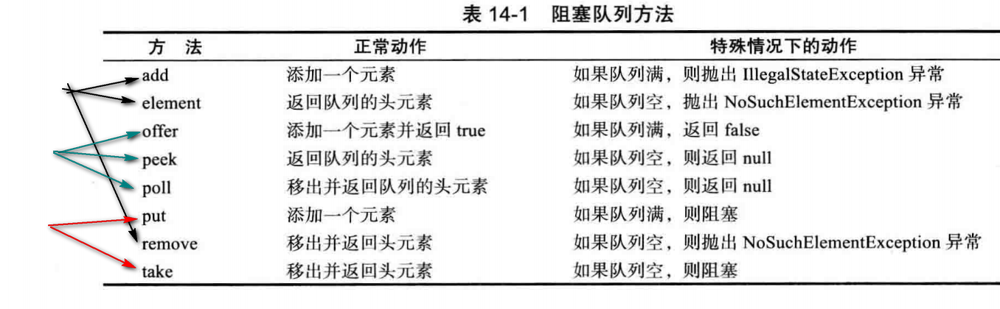

# HashMap
有以下几种：
1. Collections.synchronizedMap(map)
2. HashTable
3. ConcurrentHashMap
(尽可能用`ConcurrentHashMap`)

# CopyOnWriteArrayList 
在很多应用场景中，读操作的频率远远大于写操作。如果每次读取都进行加锁操作，其实是一种资源浪费。  
`CopyOnWriteArrayList` 读取是完全不用加锁的，写入也不会阻塞读取操作，只有写入和写入之间需要进行同步等待，读操作的性能得到大幅度提升。  

# ConcurrentHashMap
假设有如下代码：
```java
Long oldValue = map.get(word);
Long newValue = oldValue == null ? 1: oldValue + 1;
map.put(word, newValue); // Error-might not replace oldValue
```

ConcurrentHashMap 的put方法是线程安全的，但是这个代码块整体不是线程安全的。有几种对策：
1. 使用 replace 操作,直到 replace 成功
```java
do{
    oldValue = map.get(word);
    newValue = oldValue = null ? 1 : oldValue + 1;
} while (!map.replace(word, oldValue, newValue));
```
2. 仅针对该需求，可以将Long改为AtomicLong 或者 LongAdder: ConcurrentHashMap<String，AtomicLong>
或者 ConcurrentHashMap<String，LongAdder>。并借助putlfAbsent
```java
map.putlfAbsent(word, new LongAdderO);//putlfAbsent是原子的
map.get(word).increment();
```
note: 高并发下LongAdder的性能比AtomicLong有显著提升。但是AtomicLong功能更丰富。  
或者还有一下类似putlfAbsent的方法如：
computeIfPresent 和 computeIfAbsent
分别只在*已经有原值*或者*没有原值*的情况下计算新值.
```java
map.computelfAbsent(word , k -> new LongAdder()).increment() ;
```
3. compute方法
compute(K key, BiFunction remappingFunction)： 根据指定的key，查找value；然后根据得到的value和remappingFunction重新计算新值，并替换旧值。
```java
map.compute(word , (k, v) -> v = null ? 1: v + 1);
```


## 阻塞队列BlockingQueue
PriorityBlockingQueue LinkedBlockingDeque LinkedBlockingQueue ArrayBlockingQueue 等  
方法分为三类(异常、返回状态、阻塞)：
 


